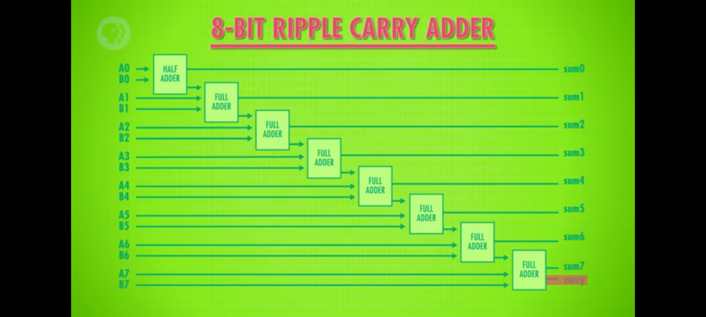

# Тема 1: История и структура на компютърните системи

## Съдържание

1. [Кратка история на компютърните системи](#1-кратка-история-на-компютърните-системи)
2. [Основни компоненти на компютърната система](#2-основни-компоненти-на-компютърната-система)
3. [Булева алгебра. От транзистори до логически елементи](#3-булева-алгебра-от-транзистори-до-логически-елементи)
4. [Защо използваме двоична бройна система? Записване на положителни и отрицателни цели числа, дроби и символи с двоични числа](#4-защо-използваме-двоична-бройна-система-записване-на-положителни-и-отрицателни-цели-числа-дроби-и-символи-с-двоични-числа)
5. [Аритметично логическо устройство (АЛУ) - какво представлява и как се изгражда от логически елементи](#5-аритметично-логическо-устройство-алу---какво-представлява-и-как-се-изгражда-от-логически-елементи)
6. [Компютърна памет - регистри и Random Access Memory (RAM)](#6-компютърна-памет---регистри-и-random-access-memory-ram)
7. [Процесор на компютърната система](#7-процесор-на-компютърната-система)

---

## 1. Кратка история на компютърните системи

**Бележка:** Точката няма да се включва в тестове/изпитите по предмета. Тя служи
само за въведение в курса.

- **19-ти век**

  - Първоначално Чарлз Бабидж разработва "разностно устройство", което може да се
    разглежда като механичен калкулатор.
  - След това проектира и се опитва да построи "аналитично устройство" през 1837
    г.
  - Реализирано е няколко години по-късно през 1841 г.
    
    _Фиг. 1.1.1. Аналитично устройство на Чарлз Бабидж_

- **1940-те г.**

  - Първите електронни компютри.
  - Ускореният прогрес се дължи на напредъка на електронни компоненти през 30-те
    години (релета, вакумни лампи, кондензатори) и Втората световна война.
  - Програмират се с перфокарти.
  - Fun fact: първият компютърен бъг е открит 1947 г. и е бил... истинска бубoлечка.
    
    _Фиг. 1.1.2. Първият компютърен "bug"_

- **1950-те г.**

  - Започват да се използват транзистори вместо вакумни лампи.
  - Има няколко проблема с компютърните системи:
    - всяка програма трябва да се пише за конкретния модел машина върху който ще
      се изпълнява;
    - също така, програмата трябва да работи директно с хардуерните ресурси, без
      никаква абстракция.
  - Първата операционна система - GMOS
    - Разработена от General Motors за IBM 701.

- **1960-те г.**

  - Първите интегрални схеми – микрочипове, като компютри, които ги използват се
    появяват през 1963 г.
  - Многозадачност - в оперативната памет едновременно се намират няколко задания;
    когато някое от заданията чака за изпълнение на входно/изходна операция, процесорът
    може да премине към обработване на друго задание.
  - Времеделение - времето на процесора се разделя между всички потребители.
  - Началото на работа по Unix - 1969 г.

- **1970-те г.**

  - Започва ерата на персоналните компютри.
  - Първият публично достъпен програмен език - Fortran.
  - Първият прототип на графичен потребителски интерфейс (GUI)
    - Разработен от Xerox Palo Alto Research Center през 1979 г.
    - Стив Джобс, търсейки нови идеи за работа в бъдещи итерации на Apple компютрите,
      дава 1 мил. долара акции на Xerox, в замяна за подробна обиколка на техните
      съоръжения и текущи проекти. Така се запознава с GUI и мишката.

- **1980-те г.**

  - MS DOS през 1981 г., Microsoft Windows 1.0 през 1985 г.
  - Apple Lisa през 1983 г. - първият компютър на Apple с мишка и GUI.

- **1990-те г.**

  - NeXTStep (1991 г.) операционната система, която по-късно става macOS.
  - Linux (1991 г.)
    - "I'm doing a (free) operating system (just a hobby, won't be a big and professional
      like gnu)" - Линус Торвалдс.
    - [Why so many distros? The Weird History of Linux - Fireship](https://youtu.be/ShcR4Zfc6Dw)

- **Източници и материали**

  - [Early Computing: Crash Course Computer Science #1](https://youtu.be/O5nskjZ_GoI)
  - [Electronic Computing: Crash Course Computer Science #2](https://youtu.be/LN0ucKNX0hc)

## 2. Основни компоненти на компютърната система

_Фиг. 1.2.1.: Пример за структура на хардуера на компютърна система_

Всяка компютърна система съдържа следните 3 компонента:

- **Централен процесор (CPU)**

  - Изпълнява инструкии, обработва данни, изчислява.
  - Чрез него операционната система (ОС) контролира останалите компоненти.

- **Оперативна памет (RAM)**

  - Памет върху която можем да записваме информация и да я четем.
  - Използва се за запазване на инструкции към процесора и данни на приложните
    програми/операционната система (малко по-подробно в следващите точки).
  - Енергозависима - информацията не се пази при изключване на системата.

- **Системна шина (System bus)**

  - Компонент чрез който се извършва комуникацията между останалите компоненти.
  - Може да ви е познат още като дънна платка (motherboard).

Също така, почти винаги системата има и:

- **Входно/Изходни устройства (IO Devices)**

  - Устройства, с които операционната система може да комуникира - да изпраща информация
    към тях или да получава информация от тях.
  - Примери за входно-изходни устройства са мишките, принтерите, мониторите, записващите
    устройства, като HDD, SSD и т.н.
  - В частност ще разгледаме записващите устройства:
    - Енергонезависима памет - информацията се запазва, дори и системата да бъде
      изключена.
    - По-бавни и по-обемни от оперативната памет.

В следващата тема ще разгледаме как ОС управлява хардуера и предоставя достъп
до него на потребителските програми чрез API (приложно-програмен интерфейс).

## 3. Защо използваме двоична бройна система? Записване на положителни и отрицателни цели числа, дроби и символи с двоични числа

- **Защо компютърните системи използват 2 състояния, а не повече?**

  - Не винаги е било така - първите компютри използвали 10-ична бройна система.
    Това е било по-просто за хората, които са ги използвали/програмирали, но не
    и от механична и електрическа гледна. Примерно в някои варианти на много ранни
    компютърни системи, за запазването на 10-ичните числа са се използвали зъбни
    колела, като за всяко число са били нужни по 10 зъба.
  - Друг начин за използване на 10-ична бройна система в компютърна система е, чрез
    четене на степените на напрежение на електрически сигнал.
  - Проблемът с този подход е, че за да се представи едно число, са необходими
    повече състояния на електрически сигнал, което води до по-голяма сложност на
    електронните компоненти и по-голям шанс за грешки. Освен това, има по-голям
    шанс за грешки при пренос на информация породени от ел. шум и други фактори.
  - 2-ичната бройна система е по-подходяща за електронни устройства, тъй като
    транзисторите имат само 2 състояния - включен и изключен.
  - Обработката на двоичните числа е много по-лесна и по-бърза отколкото на
    10-ичните числа; електронните компоненти са по-евтини и по-надеждни.
  - Всички основни типове данни могат да бъдат представени чрез двоични числа.

- **Записване на цели числа**

  - Записване на положително число в двоична бройна система става по същия начин
    като в десетична, но със съответните степени на 2-ката.
    Пример: 10 (десетично) = 1010 (двоично)
  - В езика C, за да се отбележи, че числото е двоично, се добавя префикс `0b` пред
    числото. Пример: `0b1010`, `0b1010==10 // true`.
  - В езика C, има няколко възможни размери на целочислените типове:
    - `char` - 1 байт (8 бита)
    - `short` - 2 байта (16 бита)
    - `int` - 4 байта (32 бита)
    - `long` - 8 байта (64 бита)
    - `long long` - 8 байта (64 бита)
  - В C, за да се отбележи, че числото е отрицателно, първият бит се използва за
    знака (0 - положително, 1 - отрицателно).
  - Едно цяло число може да е signed или unsigned. В signed числата, първият бит
    се използва за знака, а в unsigned числата, първият бит се използва за представяне
    на числото.
    - Пример: `char` може да бъде `signed char` или `unsigned char`. Тогава стойностите
      на `char` са от -128 до 127, а на `unsigned char` от 0 до 255.

- **Записване на дроби**

  - Дробните числа в C са представени чрез `float` и `double`, които са с размери
    32 и 64 бита съответно.
  - Нека разгледаме как се представя 32 битово дробно число в двоична бройна система.
    
    _Фиг. 1.3.1.: IEEE 754 32-bit floating point_

    - Първият бит се използва за знака.
    - Следващите 8 бита се използват за експонентата на числото - степен на 2-ката,
      с която се умножава мантисата.
    - Останалите 23 бита се използват се наричат мантиса - дробната част на числото.
    - Пример: 2.5 == `0 10000000 01000000000000000000000`.
    - При 64 битовите числа, експонентата е 11 бита, а мантисата е 52 бита.

  - Важно е да се отбележи, че дробните числа в двоична бройна система са представени
    по същия начин като целите числа, но се използва и десетична запетая.

    - Пример: 2.5 == 0b10.1 (двоично).

  - При използване на дробни числа, винаги трябва да се има предвид, че те не винаги
    са точни и може да се получат грешки при изчисленията.
    - Пример: Пробвайте да изпълните следната проверка
      `0.1 + 0.2 == 0.30000000000000004// true`, в език за програмиране по ваш избор.

- **Записване на символи**

  - Символите също се представят чрез двоични числа.
  - В C, символите се представят чрез ASCII (American Standard Code for Information
    Interchange).
  - ASCII таблицата е 7-битова таблица и съдържа 128 символа.
    - Пример: `A` == `0b1000001`, `a` == `0b1100001`.
  - В C, символите се представят чрез типа `char` (1 байт, 8 бита).
  - В последствие на разпространението на компютрите по света, възниква нуждата
    да се добавят и допълнителни символи - примерно кирилица, китайски и японски.
    - Първоначално се използвали останалите 128 символа от ASCII таблицата за
      представяне на допълнителни символи. Всяка страна има своята таблица за символи.
    - Това води до проблеми при обмен на информация между различни компютърни системи.
      Съобщение изпратено от компютър на една страна може да не се представи правилно
      от компютър на друга страна.
    - За да се реши този проблем, се създават Unicode и UTF-8.
      - Unicode - 16 битова таблица, която съдържа повече от 65,000 символа.
      - UTF-8 - Unicode Transformation Format 8-bit, който представя Unicode символите
        с 1, 2, 3 или 4 байта.

- **Източници и материали**

  - [Why Computers Use Binary - Numberphile](https://youtu.be/thrx3SBEpL8)
  - [Floating Point Numbers - Computerphile](https://youtu.be/PZRI1IfStY0)
  - [Boolean Logic & Logic Gates: Crash Course Computer Science #3](https://youtu.be/gI-qXk7XojA)
  - [Representing Numbers and Letters with Binary: Crash Course Computer Science #4](https://youtu.be/1GSjbWt0c9M)

## 4. Булева алгебра. От транзистори до логически елементи

- **Логически елементи**

  

  _Фиг. 1.4.1.: Логически елементи_

  - Логическите елементи са електронни компоненти, които извършват логически операции
    над един или повече входни сигнали и генерират един или повече изходни сигнали.
  - Логическите елементи се използват за изграждане на логически схеми, които се
    използват в компютърните системи.
    - Примери за логически елементи са: AND, OR, NOT, XOR и др.
    - От основно значение за компютърните системи са логическите елементи AND, OR,
      NOT и XOR, така че ще ги разгледаме в следващите точки.

- **Логически елемент NOT**

  - Логическият елемент NOT (инвертор) е елемент, който променя състоянието на входния
    сигнал.

    - Входът на логическия елемент NOT може да бъде 0 или 1.
    - Ако входът е 0, то изходът е 1.
    - Ако входът е 1, то изходът е 0.

  - Таблица на истинност:

    | A   | Q   |
    | --- | --- |
    | 0   | 1   |
    | 1   | 0   |

  - Електреската схема на NOT се състои от 1 транзистор. При подаване на напрежение
    на входният сигнал (базата на транзистора) се отваря транзистора и токът преминава
    през него, към земята. Съответно, изходният сигнал е 0. При липса на напрежение
    на входният сигнал, транзистора е затворен и токът не може да премине през него.
    Тогава, изходният сигнал е 1.

    

    _Фиг. 1.4.2.: Електрическа схема на NOT_

- **Логически елемент AND**

  - Логическият елемент AND е елемент, който извършва логическа операция "И" над
    два входни сигнала.
    - Входът на логическия елемент AND може да бъде 0 или 1.
    - Ако и двата входа са 1, то изходът е 1.
    - В противен случай, изходът е 0.
  - Таблица на истинност:

    | A   | B   | Q   |
    | --- | --- | --- |
    | 0   | 0   | 0   |
    | 0   | 1   | 0   |
    | 1   | 0   | 0   |
    | 1   | 1   | 1   |

  - Електрическата схема на логическия елемент AND се състои от 2 транзистора и 2
    входа. При подаване на напрежение на входните сигнали (базите на транзисторите)
    се отварят транзисторите и токът преминава през тях, към земята. Съответно,
    изходният сигнал, който е свързан към изхода на транзисторите, е 1. При липса
    на напрежение на някой от входните сигнали, токът не може да премине през транзисторите.
    Тогава, изходният сигнал е 0.

    

    _Фиг. 1.4.3.: Електрическа схема на AND_

- **Логически елемент OR**

  - Логическият елемент OR е елемент, който извършва логическа операция "ИЛИ" над
    два входни сигнала.
    - Входът на логическия елемент OR може да бъде 0 или 1.
    - Ако поне един от входовете е 1, то изходът е 1.
    - В противен случай, изходът е 0.
  - Таблица на истинност:

    | A   | B   | Q   |
    | --- | --- | --- |
    | 0   | 0   | 0   |
    | 0   | 1   | 1   |
    | 1   | 0   | 1   |
    | 1   | 1   | 1   |

  - Електрическата схема на OR се състои от 2 транзистора и 2 входа, свързани към
    базите на транзисторите. При липса на напрежение на входните сигнали, транзисторите
    са затворени и токът не може да премине през тях и изходният сигнал е 0. При
    подаване на напрежение на поне един от входните сигнали, транзисторите се отварят
    и токът преминава през тях към земята. Съответно, изходният сигнал е 1.

    

    _Фиг. 1.4.4.: Електрическа схема на OR_

- **Логически елемент XOR**

  - Логическият елемент XOR е елемент, който извършва логическа операция "ИЗКЛЮЧВАЩО
    ИЛИ" над два входни сигнала.

    - Входът на логическия елемент XOR може да бъде 0 или 1.
    - Ако входовете са различни, то изходът е 1.
    - В противен случай, изходът е 0.

  - Таблица на истинност:

    | A   | B   | Q   |
    | --- | --- | --- |
    | 0   | 0   | 0   |
    | 0   | 1   | 1   |
    | 1   | 0   | 1   |
    | 1   | 1   | 0   |

  - Електрическата схема на XOR се състои от 4 транзистора и 2 входа. При липса на
    напрежение на входните сигнали, транзисторите са затворени и токът не може да
    премине през тях и изходният сигнал е 0. При подаване на напрежение на един от
    входните сигнали, транзисторите се отварят и токът преминава през тях към земята.
    Съответно, изходният сигнал е 1. При подаване на напрежение на двата входа,
    токът преминава през транзисторите и изходният сигнал е 0.

    

    _Фиг. 1.4.5.: Логическа схема на XOR_

- **Източници и материали**
  - [Boolean Logic & Logic Gates: Crash Course Computer Science #3](https://youtu.be/gI-qXk7XojA)

## 5. Аритметично логическо устройство (АЛУ) - какво представлява и как се изгражда от логически елементи

- **Какво е АЛУ?**

  - Аритметично логическото устройство (АЛУ) е част от централния процесор (Central
    Processing Unit, CPU), която извършва аритметични и логически операции.
  - Представлява математическия "мозък" на компютърната система.
  - АЛУ-то може да извършва операции като събиране, изваждане, умножение, деление.
    Също така, изпълнява логически операции като AND, OR, NOT, XOR и др.
  - АЛУ-то получава входни данни от регистри (ще разгледаме какво представляват
    те по-надолу) и изпраща резултата на операциите обратно в регистрите.
  - Разделено е на 2 части:
    - Аритметична част - извършва аритметични операции, като събиране, изваждане,
      умножение, увеличаване на стойност и др.
    - Логическа част - извършва логически операции, като например, проверка на равенство,
      проверка за по-голямо, по-малко, AND, OR, NOT, XOR и др.
  - Ще разгледаме събирането на две двоични числа като пример за аритметична операция
    на АЛУ-то, но е важно да се отбележи, че това далеч не е единствената операция,
    която може да извършва.
  - Също така, ще разгледаме операцията "сравняване на число с 0", като пример за
    логическа операция. Тя, примерно, може да се използва при сравнението за равенство
    на 2 n-битови числа.

- **Реализация на суматор с логически елементи**

  - **Half-Adder**

    - Първоначално ще разгледаме Half-Adder. Той е най-простия логически елемент,
      който извършва събиране на две единични бита.
    - Half-Adder има 2 входа - A и B и 2 изхода - сума (S) и пренос (C).
    - Има четири възможни комбинации на входните сигнали и съответните изходи:

      | A   | B   | C   | S   |
      | --- | --- | --- | --- |
      | 0   | 0   | 0   | 0   |
      | 0   | 1   | 0   | 1   |
      | 1   | 0   | 0   | 1   |
      | 1   | 1   | 1   | 0   |

  - Логическата схема на Half-Adder се състои от 2 логически елемента - XOR и AND.
    Входните сигнали се подават на XOR, който определя стойността на сумата и на
    AND - определящ остатъка.

    
    

    _Фиг. 1.5.1.: Half-Adder_

  - **Full-Adder**

    - Full-Adder извършва събиране на 3 бита - две входни стойности и остатък от
      предишно събиране.

    - Приема 3 входа - A, B и C (остатък от предишно събиране) и има 2 изхода - сума
      (Sum) и пренос (Carry).

    - Има осем възможни комбинации на входните сигнали и съответните изходи:

      | A   | B   | C   | Sum | Carry |
      | --- | --- | --- | --- | ----- |
      | 0   | 0   | 0   | 0   | 0     |
      | 0   | 0   | 1   | 1   | 0     |
      | 0   | 1   | 0   | 1   | 0     |
      | 0   | 1   | 1   | 0   | 1     |
      | 1   | 0   | 0   | 1   | 0     |
      | 1   | 0   | 1   | 0   | 1     |
      | 1   | 1   | 0   | 0   | 1     |
      | 1   | 1   | 1   | 1   | 1     |

    - Логическа схема на Full-Adder може да. се изгради от 2 Half-Adder-а и един
      OR gate.

      
      

      _Фиг. 1.5.2.: Full-Adder_

  - **N-битов суматор**

    - Нека имаме 2 n-битови числа A и B, които искаме да съберем.

      - Цифрите на числата ще представяме с An-1, An-2, ...,
        A0 и Bn-1, Bn-2, ..., B0.

    - Започваме от най-младшите битове (т.е. A0 и B0):

      - При събиране на двата бита A0 и B0 получаваме сума S0
        и пренос C0.
      - Сумата S0 е равна на A0 XOR B0>.
      - Преносът C0 е равен на A0 AND B0>.
      - За събирането използваме Half-Adder, защото имаме само 2 входни бита.

    - При събирането на всеки два следващи бита Ai и Bi (i > 0):
      - За събирането използваме Full-Adder, защото имаме 3 входни бита - . Ai,
        Bi и преноса от предишното събиране Ci-1.
      - Сумата Si е равна на Ai XOR Bi XOR Ci-1.
      - Преносът Ci е равен на (Ai AND Bi) OR
        (Ai AND Ci-1) OR (Bi AND Ci-1).

  - Схема на N-битов суматор:

    

    _Фиг. 1.5.3.: N-bit Adder_

- **Реализация на сравнение на число с 0 с логически елементи**

  - **Zero Comparator**

- **Реализация на ALU**

- **Източници и материали**
  - [How Computers Calculate - the ALU: Crash Course Computer Science #5](https://youtu.be/1I5ZMmrOfnA)

## 6. Компютърна памет - регистри и Random Access Memory (RAM)

- **Източници и материали**
  - [Registers and RAM: Crash Course Computer Science #6](https://youtu.be/fpnE6UAfbtU)

## 7. Процесор на компютърната система

- **Източници и материали**
  - [Central Processing Unit (CPU): Crash Course Computer Science #7](https://youtu.be/npGLq0UMb6o)
