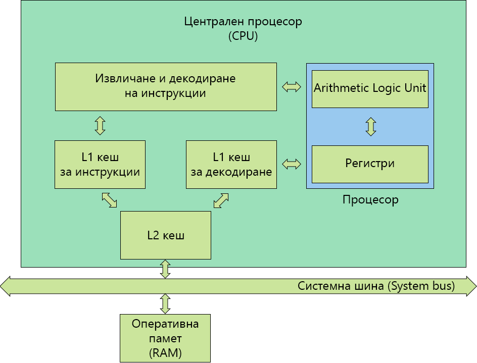

## 1. Какво се случва в процесора? (преговор от миналата лекция)


_Фиг. 2.1.1.: Структура на централния процесор_

- **ALU - Аритметико-логическия блок (Arithmetic Logic Unit)**

  - Използва сe за извършване на аритметични операции и логически операции – събиране,
    изваждане, умножение, деление и сравняване на две числа.
  - Обработва данните от регистрите на процесора.
  - От него зависи скоростта на изчислителния процес.
  - Изграден е от логически елементи - `OR`, `NOR`, `AND`, `NAND`, `XOR`, `NOT`,
    т.н. (които логически елементи са изградени от транзистори)

- **Регистри (Registers)**

  - Те са най-бързата памет в една компютърна система
  - Използват се при изчисленията на от аритметико-логическия блок
  - Разделят на 2 вида:
    - Регистри с общо предназначение.
    - Контролни регистри.
    - Виж следващата точка за повече информация.

- **Кеш памет (Cache Memory)**

  - Малка, но доста бърза памет.
  - Използва се за да се запазят данните, които са използвани най-често при изпълнение
    на инструкции от процесора, за да се ускори достъпа до тях
  - Това се налага, защото извличането на данни от RAM паметта е скъпа операция
    (т.е. става доста бавно), в сръвнение от това да се извика от кеш паметта.
  - Kеш паметта бива на няколко нива L(evel)1, L2 и L3 (L3 от 2003 година, с Pentium
    4 Extreme Edition)

  - **L1 кеш**

    - Директно комуникира с регистрите.
    - Разделя на 2 части
      - L1D (Data) - за съхраняване на стойности като числа, адреси, т.н., които
        са използвани най-често.
      - L1I (Instruction) - за съхранение на инструкциите, които са използвани най-често.
      - L1I минава през процес на извличане и декодиране на самите инструкции.
      - Типичният размер на L1 кеша е от 16KB до 1MB.

  - **L2 и L3 кеш**
    - Те представляват медиаторите между L1 и RAM паметта.
    - По-бавни са от L1, но са в пъти по-бързи от RAM паметта.
    - По-големи са от L1 - с размери от 256KB до 64MB.

## 2. Видове регистри на процесора

Процесорните регистри се разделят на два типа:

- **Регистри с общо предназначение**

  - Достъпни са за всички програми.
  - Могат да се адресират като се използва езика Assembly

    Пример:

    ```asm
    MOV AX, 42
    ```

    `MOV` е кратък код за инструкцията за "преместване". Използва се за копиране
    на данни от едно място на друго. `AX` е регистър. `,` е разделител, а `42`
    е константа, която се премества в регистъра AX.

  - Има два подтипа регистри с общо предназначение:
    - Регистри за данни:
      - Използват се за променливи.
    - Адресни регистри:
      - Използват се за реализация на различни схеми за адресация.
      - Използват се за индексанция и указатели.

- **Контролни регистри**
  - Използват се от процесора за да контролират работата му.
  - Използват се от операционната система за да контролират изпълнението на приложните
    програми.
  - Не са достъпни директно от потребителските програми.
  - Примери за контролни регистри са:
    - Програмен брояч (Program Counter – PC)
      - Съдържа адреса на следващата инструкция, която трябва да бъде извлечена.
    - Регистър за инструкция (Instruction Register – IR)
      - Съдържа последната извлечена от паметта инструкция.
    - Регистър на състоянието (Program Status Word – PSW)
      - Резултат от сравнения.
      - Разрешаване и забрана на прекъсванията (виж т. 2.4.)
      - Потребителски режим и защитен режим на процесора (виж т. 2.5.)
