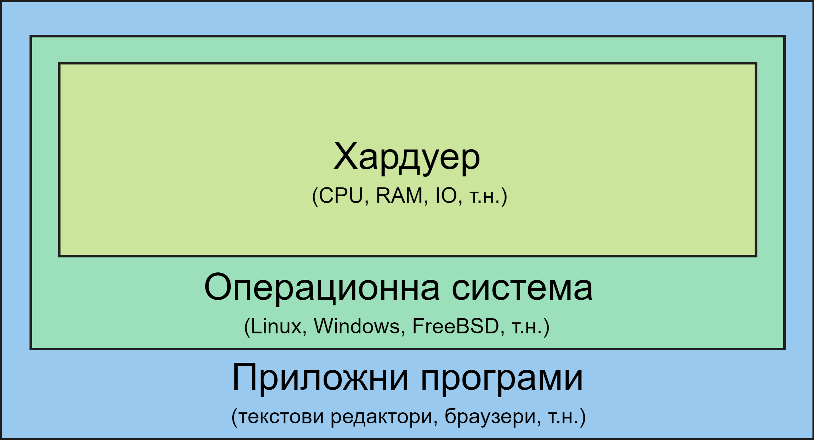

## 1. Какво е операционна система?

_Фиг. 2.1.1.: Обща структура на компютърна система_

- За жалост, няма общоприета конкретна дефиниция за операционна система (ОС).
- Операционната система контролира хардуера на системата.
- Също така предоставя недиректен достъп на програмите към него чрез API (приложно-програмен
  интерфейс). Този интерфейс също така поставя ограничения до какво имат достъп
  потребителските програми.
  Примери:

  - `malloc()` и `free()` за заделяне на динамична памет
    - операционната система решава, дали програмата има право да задели тази памет.
  - виртуалната адресна таблица
    - спиране при опит за достъп на памет върху която нямаме право да променяме
      (SEGFAULT)
  - достъпване на файлове с `read()` и `write()` - файловете имат права за достъп,
    т.е. операционната система може да ни върне грешка при използването на тези
    команди

## 2. Цели на операционните системи

- Многозадачност

  - Модерните операционни системи трябва да позволяват паралелното изпълнение
    на програми.
  - Обработката на инструкции от централния процесор (или поне на едно ядро от него),
    обаче, е последователна.
  - Илюзията за многозадачност (паралелно изпълнение) се постига чрез използване
    на таймери, които генерират прекъсвания на определено време (интервал).
  - Прекъсвания сменят процеса (задачата), която се изпълнява от процесора. Това
    се нарича **времеделние**.
  - Процесите изпълняващи се на един процесор се сменят на много кратко време,
    в зависимост от приоритета им, като времеделението се извършва чрез таймери,
    които генерират прекъсвания на определено време (интервал).
  - В днешно време, процесорите често имат по няколко ядра, които могат да изпълняват
    задачи едновременно (може да ги разглеждаме като няколко процесора в една компютърна
    система).
  - Върху всяко ядро се реализира времеделение.

- Многопотребителност
  - Компютрите много често се използват от няколко потребители.
  - Многопотребителността е способността на операционната система да поддържа различни (множество) потребители.

## 3. Структура на операционните системи

Операционната система може да се раздели на две части:

- Ядро (Kernel)

  - Най-ниското ниво на една операционна система.
  - Отговаря за управлението на различните части на една компютърна система - т.е.
    директно управлява хардуера
  - Това е единственият компонент, който може да работи в привилегиран режим (privileged
    mode) на процесора (виж предишната тема).
  - Ядрото съдържа всички драйвери за устройствата (софтуер за оправляване на устройствата),
    които се намират в компютърната система.
  - Ядрото предоставя и функции, наречени **системни повиквания** (на англ. system
    calls или на кратко sys-calls), които могат да се извикват от потребителските
    програми или от други части на операционната система. Някои типове системни
    функции са следните:
    - Функции за управление на процесите – `fork()`, `waitpid()`, `execvpe()`, `exit()`, т.н.
    - Функции за работа с файлове – `open()`, `close()`, `read()`, `write()`, `lseek()`, т.н.
    - Работа с файловата система – `stat()`, `mkdir()`, `rmdir()`, `link()`, `unlink()`, `mount()`, `umount()`, `chmod()`.
    - и други.

- Обвивка (Shell)
  - Командния интерпретатор е набор от приложни програми, които комуникират с ядрото
    чрез системни извиквания.
  - Предоставя среда и интерфейс за улеснена работа с операционната, както на хора,
    така и на други приложни програми.
  - Това е видимият потребителски интерфейс на операционната система.
  - Обикновено се зарежда върху нея и предлага на потребителите команди, които
    им осигуряват достъпа до операционната система - примерно както GNU+Linux са
    неразделни части на една цяла система - GNU - shell, Linux - kernel.
